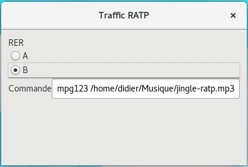
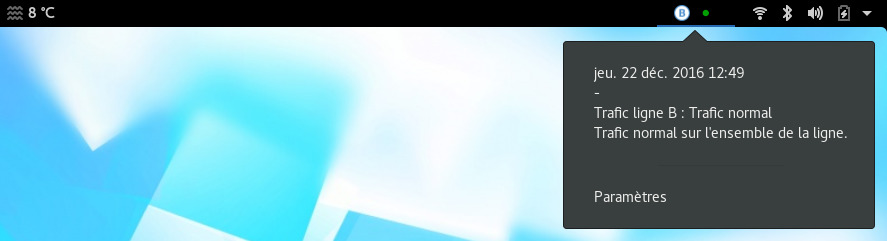
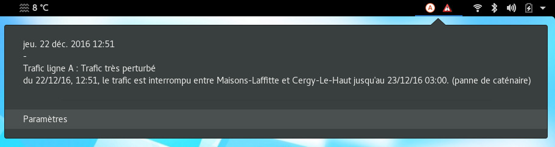

# Gnome shell extension for RATP Traffic status

## Motivation

<ol>
<li>To "play" with gnome-shell extensions :-) </li>
<li>To have a look on RAPT Traffic status from my Gnome desktop</li>
</ol>

## Usage

* Select a RATP RER Train line to be requested from "Settings" menu

 

Note : You can specify a command which will be launched on line status changes.

* Every 30 sec, status will be refreshed :

  * Everything is ok :

  * Something is wrong :

Note : if you switch from one line to another, you have to click twice on extension icon in order to refresh the message.

## Installation

- copy _trafficRATP@dlallemand_ extension into  ~/.local/share/gnome-shell/extensions/
- Restart Gnome-Shell (ALT+F2, r)

## Contribution

Please feel free to contribute by sending pull requests or raising issues.

## License

Licensed under the GNU General Public License Version 2. See COPYING for details.

## Authors

- dlallemand (Didier Lallemand)
- (and thanks to Pierre Grimeau for RATP API : https://github.com/pgrimaud/horaires-ratp-api)
